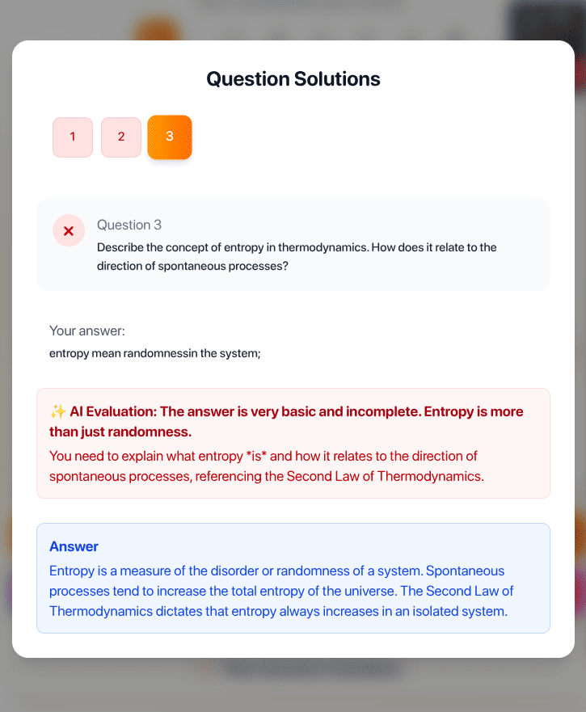
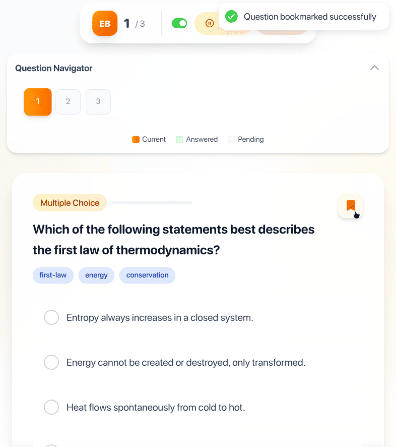
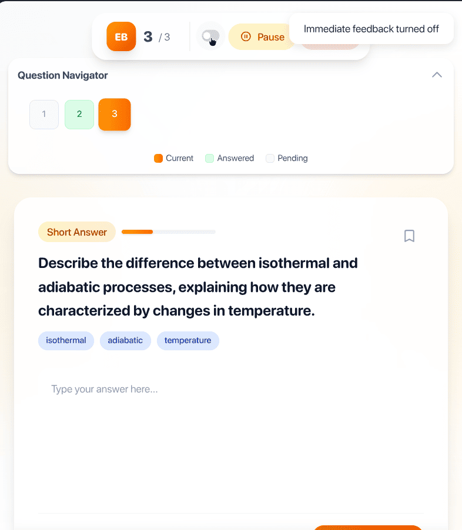
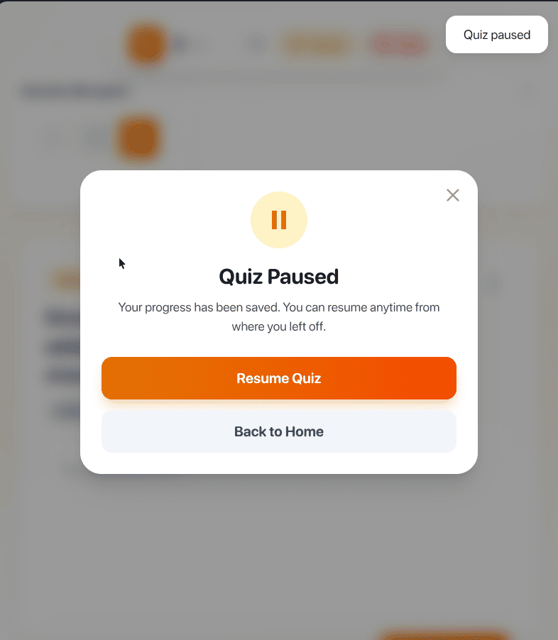
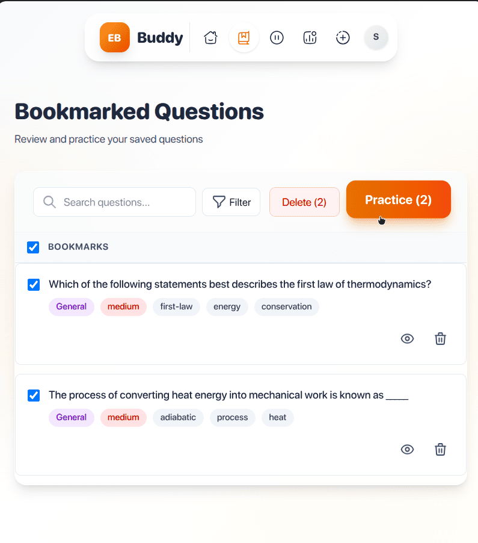
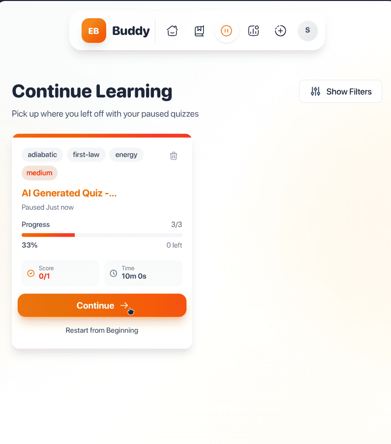

# Exam Buddy: Stop studying what you already know


**Found knowledge gaps but stuck doing full generic tests? Convert any content—webpages, PDFs, or notes—into targeted, adaptive AI quizzes built for active recall and faster mastery. 100% offline, 100% private.**

---

## 🎬 See It In Action

<p align="center">
  
</p>

<details>
<summary><b>📸 Click to see more screenshots</b></summary>

<table>
  <tr>
    <td width="50%">
      
      <p align="center"><i>AI Evaluation</i></p>
    </td>
    <td width="50%">
      
      <p align="center"><i>Multiple question types</i></p>
    </td>
  </tr>
  <tr>
    <td width="50%">
      
      <p align="center"><i>Instant AI-powered feedback</i></p>
    </td>
    <td width="50%">
      
      <p align="center"><i>Pause and Save quiz</i></p>
    </td>
  </tr>
  <tr>
    <td width="50%">
      
      <p align="center"><i>Bookmarked Questions</i></p>
    </td>
    <td width="50%">
      
      <p align="center"><i>Continue Learning</i></p>
    </td>
  </tr>
</table>

</details>

---

## The Problem: Stop Studying What You Already Know

Ever been stuck on a single, tricky topic while preparing for an exam?

This project was born from a real frustration. While studying for a test, I was weak in **"fixed prepositions."** I searched for practice materials, but all I found were:
- Long articles (passive reading that didn't stick)
- Generic mock exams where only 2 out of 50 questions were relevant
- Hours wasted on topics I already knew

**This is a universal problem.** Traditional study methods spray content everywhere—you hit everything, but your specific weak spots get little attention.

### Exam Buddy is your laser-focused study tool

It's a precision instrument designed to eliminate your specific knowledge gaps. Instead of doing another generic test, you can create a focused, personalized quiz on the *exact* topic you're struggling with—instantly.

**Core Mission:** Empower you to practice smarter, not just harder, by turning any content into a targeted, adaptive learning experience.

---

## Quick Start

### Build from Source

1. **Clone the repository:**
   ```bash
   git clone https://github.com/AnchitSingh/exam-buddy.git
   cd exam-buddy
   ```

2. **Install dependencies:**
   ```bash
   npm install
   ```

3. **Build the extension:**
   ```bash
   npm run build
   ```

4. **Load in Chrome:**
   - Navigate to `chrome://extensions`
   - Enable **Developer mode** (top right)
   - Click **Load unpacked**
   - Select the `dist` folder
   - Pin the extension and start learning! 🎉

---


## Key Features

### AI-Powered Quiz Generation
Instantly create quizzes from **any source** with multiple question types:
- Multiple Choice (MCQ)
- True/False
- Short Answer / Subjective
- Fill in the Blanks

### 100% Private & On-Device
All AI processing happens directly in your browser using Chrome's built-in models.  
**No data ever leaves your machine.** Fast, secure, and works completely offline.

### Multiple Content Sources
- **From Selection:** Highlight any text and start a quiz instantly
- **From Webpage:** Analyze an entire article or page
- **From PDF:** Upload textbooks and turn chapters into practice tests
- **Custom Topics:** No content? Just type a topic and the AI generates a quiz from its knowledge

### Smart Learning Tools
- **AI Story Mode** - Get complex topics explained simply, as stories, or "like I'm five"
- **In-Depth Results** - AI-generated feedback on overall performance with detailed explanations
- **Personalized Recommendations** - AI suggests what to focus on next based on your weak spots
- **Progress Tracking** - Monitor stats, daily streaks, and accuracy improvements
- **Bookmarks & Resume** - Save challenging questions and pause/resume quizzes anytime

---

## Why Chrome's Built-in AI?

Unlike other AI study tools that require account signups, subscriptions, and send your data to external servers:

| ❌ Traditional AI Tools | ✅ Exam Buddy |
|---|---|
| Requires account signup | Zero setup - works out of the box |
| Monthly subscription fees | Completely free - no API costs |
| Sends data to external servers | 100% private - data never leaves your device |
| Needs internet connection | Works completely offline |
| Network latency delays | Instant responses - no waiting |

**Powered by:** Chrome's `Prompt API` and `Summarizer API` for on-device AI processing.

---

## Perfect For

| Use Case | How Exam Buddy Helps |
|---|---|
| Exam Prep | Target weak topics instead of redoing entire mock tests |
| Students | Turn lecture notes or textbook PDFs into practice quizzes |
| Language Learners | Practice specific grammar rules or vocabulary sets |
| Professional Certifications | Create focused quizzes from study guides |
| Self-Learners | Test yourself on any article, tutorial, or documentation |

---

## Usage Guide

### Method 1: Quiz from Any Webpage
1. Open any article or webpage
2. **Highlight** the text you want to study
3. **Right-click** → Select **"Start Quiz with Exam Buddy"**
4. Side panel opens with your personalized quiz! 

### Method 2: Upload a PDF
1. Click the **Exam Buddy** icon to open the side panel
2. Click **"Start New Quiz"**
3. Select **"From PDF"** and upload your file
4. Configure quiz settings and start practicing!

### Method 3: Get AI Explanations
1. Find a complex paragraph or topic
2. **Highlight** the text
3. **Right-click** → Select **"Explain using Exam Buddy"**
4. Choose a storytelling style and get a simple, AI-generated explanation

---

## Technology Stack

| Category | Technologies |
|---|---|
| **Frontend** | React, TailwindCSS |
| **Extension APIs** | `chrome.sidePanel`, `chrome.contextMenus`, `chrome.runtime`, `chrome.storage` |
| **On-Device AI** | `Prompt` API (generation), `Summarizer` API (preprocessing) |
| **State Management** | React Hooks (`useState`, `useEffect`, custom hooks) |
| **Build Tool** | Vite |

---

## Roadmap

- [ ] **Spaced Repetition System** - Optimize long-term retention with scientifically-proven intervals
- [ ] **Export & Share** - Export quizzes to share with study groups or classmates  
- [ ] **Voice Quiz Mode** - Hands-free learning with voice-based questions and answers
- [ ] **Multi-Language Support** - Practice in your preferred language
- [ ] **Learning Platform Integration** - Connect with popular educational platforms
- [ ] **Flashcard Mode** - Convert quizzes into interactive flashcards
- [ ] **Collaborative Study Rooms** - Practice together with peers in real-time

---

## Contributing

We welcome contributions! Here's how to get started:

1. **Fork** the project
2. Create your feature branch: `git checkout -b feature/AmazingFeature`
3. Commit your changes: `git commit -m 'Add some AmazingFeature'`
4. Push to the branch: `git push origin feature/AmazingFeature`
5. Open a **Pull Request**

**Found a bug?** [Open an issue](https://github.com/AnchitSingh/exam-buddy/issues)

---

## License

This project is licensed under the MIT License - see the [LICENSE](LICENSE) file for details.
